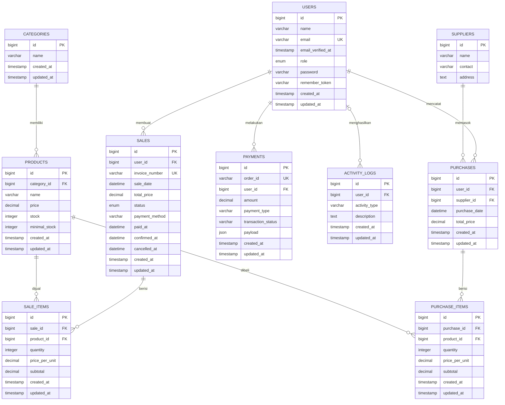

# Sistem Informasi Toko Sembako

Aplikasi web untuk mengelola operasional toko sembako, mulai dari data produk
dan pemasok, pembelian stok, transaksi penjualan, sampai laporan. Aplikasi
dibangun dengan Laravel 12 dan menerapkan pembatasan akses berdasarkan peran
pengguna.

## Fitur

### Admin

- Dashboard ringkasan operasional toko.
- CRUD data produk dan batas minimum stok.
- CRUD data pemasok.
- CRUD pengguna beserta perannya.
- Laporan penjualan, pembelian, dan produk dengan stok rendah.

### Kasir

- Membuat dan menyimpan transaksi sebagai draft.
- Membuka, mengubah, membatalkan, dan mengonfirmasi draft transaksi.
- Validasi ketersediaan stok saat pembayaran dikonfirmasi.
- Pembuatan nomor invoice secara otomatis.
- Laporan transaksi yang telah dibayar.

### Gudang

- Mencatat pembelian produk dari pemasok.
- Menambah stok produk melalui transaksi pembelian.
- Melihat laporan pembelian.

### Fitur lainnya

- Autentikasi dan otorisasi untuk peran `admin`, `kasir`, dan `gudang`.
- Lupa dan reset password.
- Pencatatan aktivitas pengguna.
- Struktur layanan integrasi Midtrans (fitur pembayaran belum terhubung ke
  route utama).

## Teknologi

- PHP `^8.2`
- Laravel `^12.0`
- Laravel Blade
- Tailwind CSS `^4.0`
- Vite `^6.2`
- SQLite sebagai konfigurasi database bawaan
- PHPUnit `^11.5`

## Persyaratan

Pastikan perangkat sudah memiliki:

- PHP 8.2 atau lebih baru beserta ekstensi yang dibutuhkan Laravel
- Composer
- Node.js dan npm
- SQLite, atau server MySQL bila ingin mengganti koneksi database

## Instalasi

1. Clone repository dan masuk ke direktori project.

   ```bash
   git clone <url-repository>
   cd project-wfd-2425
   ```

2. Install dependency backend dan frontend.

   ```bash
   composer install
   npm install
   ```

3. Salin konfigurasi environment dan buat application key.

   Windows PowerShell:

   ```powershell
   Copy-Item .env.example .env
   php artisan key:generate
   ```

   Linux/macOS:

   ```bash
   cp .env.example .env
   php artisan key:generate
   ```

4. Untuk SQLite (konfigurasi bawaan), buat file database bila belum ada.

   Windows PowerShell:

   ```powershell
   New-Item database/database.sqlite -ItemType File -Force
   ```

   Linux/macOS:

   ```bash
   touch database/database.sqlite
   ```

5. Buat tabel dan isi data contoh.

   ```bash
   php artisan migrate --seed
   ```

6. Jalankan aplikasi.

   Cara praktis untuk menjalankan web server, queue, log, dan Vite bersamaan:

   ```bash
   composer run dev
   ```

   Atau jalankan backend dan frontend pada terminal terpisah:

   ```bash
   php artisan serve
   npm run dev
   ```

7. Buka `http://127.0.0.1:8000`.

## Konfigurasi Database

Project menggunakan SQLite secara default:

```env
DB_CONNECTION=sqlite
```

Untuk menggunakan MySQL, ubah bagian database pada `.env`:

```env
DB_CONNECTION=mysql
DB_HOST=127.0.0.1
DB_PORT=3306
DB_DATABASE=nama_database
DB_USERNAME=root
DB_PASSWORD=
```

Setelah mengubah koneksi, jalankan:

```bash
php artisan migrate --seed
```

Untuk menghapus seluruh tabel, membuatnya kembali, dan mengisi ulang data
contoh:

```bash
php artisan migrate:fresh --seed
```

> Perintah `migrate:fresh` menghapus seluruh data pada database yang dipilih.

## Akun Demo

`UserSeeder` menyediakan tiga akun utama berikut:

| Peran | Email | Password |
|---|---|---|
| Admin | `admin@sembako.com` | `password` |
| Kasir | `kasir@sembako.com` | `password` |
| Gudang | `gudang@sembako.com` | `password` |

Gunakan akun ini hanya untuk lingkungan lokal/demo dan ganti password sebelum
aplikasi digunakan pada lingkungan produksi.

## Gambaran Database

Diagram berikut disusun berdasarkan migration yang ada di
`database/migrations`.



### Relasi Utama

| Tabel asal | Foreign key | Tabel tujuan | Perilaku saat data induk dihapus |
|---|---|---|---|
| `products` | `category_id` | `categories.id` | Cascade |
| `sales` | `user_id` | `users.id` | Cascade |
| `sale_items` | `sale_id` | `sales.id` | Cascade |
| `sale_items` | `product_id` | `products.id` | Cascade |
| `purchases` | `user_id` | `users.id` | Cascade |
| `purchases` | `supplier_id` | `suppliers.id` | Cascade |
| `purchase_items` | `purchase_id` | `purchases.id` | Cascade |
| `purchase_items` | `product_id` | `products.id` | Cascade |
| `payments` | `user_id` | `users.id` | Cascade |
| `activity_logs` | `user_id` | `users.id` | Diubah menjadi `NULL` |

### Tabel Pendukung Laravel

Selain tabel domain di atas, migration juga membuat tabel pendukung:

- `password_reset_tokens` dan `password_resets` untuk reset password.
- `sessions` untuk sesi pengguna berbasis database.
- `cache` dan `cache_locks` untuk cache berbasis database.

Kolom status pada `sales` menerima `draft`, `paid`, atau `cancelled`.
`invoice_number` bersifat unik tetapi nullable untuk kompatibilitas dengan data
seeder lama.

## Data Seeder

Saat `php artisan migrate --seed` dijalankan, `DatabaseSeeder` mengisi:

- akun pengguna dan pengguna contoh;
- 12 kategori sembako;
- data pemasok;
- produk beserta stok dan batas minimum stok;
- 20 transaksi pembelian beserta detail item;
- transaksi penjualan contoh.

Seeder harus dijalankan sesuai urutan dependensinya. Urutan tersebut sudah
diatur pada `DatabaseSeeder`.

## Perintah Berguna

```bash
# Melihat seluruh route aplikasi
php artisan route:list

# Menjalankan test
composer test

# Membersihkan cache Laravel
php artisan optimize:clear

# Membuat build frontend untuk production
npm run build
```

## Struktur Direktori

```text
app/
├── Http/Controllers/    # Logika autentikasi dan fitur per peran
├── Http/Middleware/     # Pemeriksaan role pengguna
├── Models/              # Model Eloquent
└── Services/            # Layanan eksternal, termasuk Midtrans
database/
├── migrations/          # Definisi tabel dan foreign key
└── seeders/             # Data awal/demo
resources/views/         # Tampilan Blade untuk admin, kasir, dan gudang
routes/web.php           # Route web dan pembatasan akses
```

## Catatan Pengembangan

- Konfigurasi email bawaan menggunakan `MAIL_MAILER=log`; tautan reset password
  akan ditulis ke log selama pengembangan.
- Variabel `MIDTRANS_SERVER_KEY`, `MIDTRANS_CLIENT_KEY`, dan
  `MIDTRANS_IS_PRODUCTION` dapat ditambahkan ke `.env` bila layanan Midtrans
  akan dikembangkan lebih lanjut.
- Migration `purchase_items` saat ini membuat tabel `purchase_items`, tetapi
  method `down()` menuliskan `pruchase_items`. Perbaiki typo tersebut sebelum
  mengandalkan rollback migration.
- Project memiliki dua tabel token reset password (`password_reset_tokens` dan
  `password_resets`). Implementasi controller saat ini memakai
  `password_reset_tokens`; evaluasi migration tambahan tersebut jika tidak
  diperlukan.

## Lisensi

Project menggunakan komponen Laravel yang berlisensi
[MIT](https://opensource.org/licenses/MIT).
